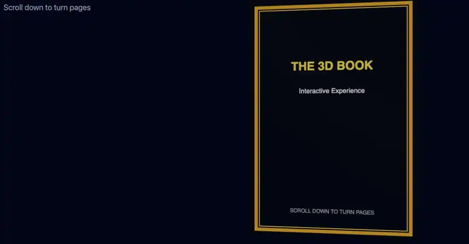

# 3D Book Component

An interactive 3D book UI component built with Three.js. It delivers a smooth, realistic page-flipping experience synchronized with the user's scroll operation.



## 📖 Overview
A UI component that combines 3D book modeling via Three.js with scroll-driven animations. By controlling the opening and closing angles of pages in real time based on scroll distance, it provides an intuitive web experience that mimics the feel of flipping through a physical paper book.

- **Live Demo:** [https://3d-book.ukyo.me](https://3d-book.ukyo.me)


## ✨ Key Features
* **Realistic 3D Modeling:** Built by combining `BoxGeometry` (front cover, back cover, spine) and `PlaneGeometry` (inner pages).
* **Scroll-Linked Animation:** Leverages `ScrollControls` to synchronize page opening/closing angles from 0° to -180° with scroll progression.
* **[WIP] Responsive Optimization:** Dynamically adjusting 3D camera composition and viewports for mobile and smaller screens.

## 🛠 Tech Stack
* **Frontend:** React, TypeScript
* **3D / Graphics:** Three.js
* **Styling:** Tailwind CSS

## 🚀 Getting Started

### Prerequisites
* Node.js
* npm / yarn / pnpm

### Installation & Local Run

```bash
# Clone the repository
git clone https://github.com/JunyaUkyou/3D-book.git

# Navigate into the project directory
cd 3D-book

# Install dependencies
npm install

# Start the development server
npm run dev